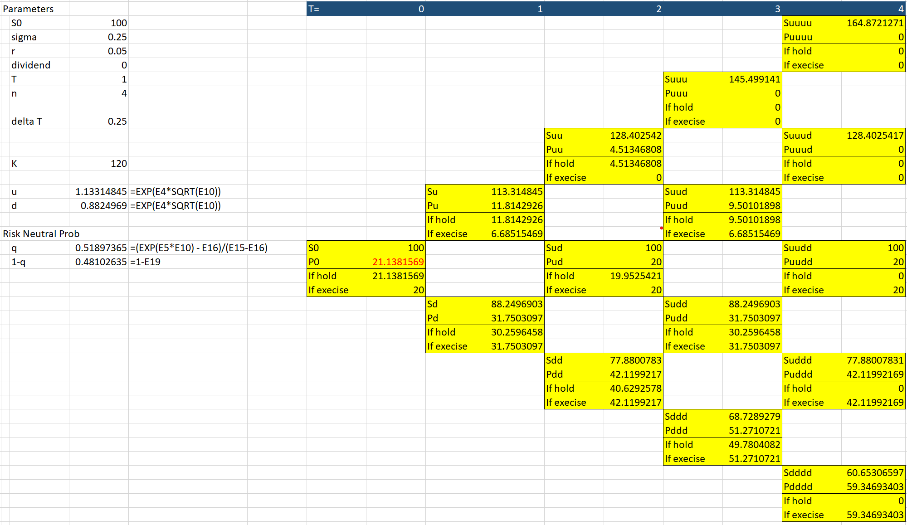

# Option Pricing
The repo is a refactorization (and some extensions) of the code for an assignment in FNCE40009 Advanced Derivative Securities.
> This repo is mainly designed for those who want to study advanced option pricing, not for commercial use.
> This is also the reason that the repo is built purely on standard numpy and scipy packages.
>
> I tried my best to utilize the speed offered by numpy array operation rather than multiple for-loops, 
> without sacrificing the ability to refer the code back to the equations in the textbook.
>
> Although I will not claim that this repo is bug-free, majority outputs are verified with the answers of some questions in the textbook.
>
> Debug/Improvements/AddOns will be implemented from time to time.
>
> If you have any questions or want to report a bug, please open an issue. I am open to any corrections/suggestions.
>

</br>

Reference: this repo is mainly an implementation of the algorithms described in the following textbook.
```
@book{mcdonald2013derivatives,
  title={Derivatives markets (3rd edition)},
  author={McDonald, Robert Lynch},
  year={2013},
  publisher={Pearson Education}
}
```

## Binomial Excel Illustration

</br>

<p align="center">
    
</p>

</br>

## Black-Scholes-Merton (BSM) Chapter 12
How to use: `example_BSM.py`
 * Chapter 12.1: European call `call_value()`, European put `put_value()`
 * Chapter 12.2: (class) `GarmanKohlhagenForex`
 * Chapter 12.5: implied volatility assume BSM model `imp_vol()`
 * Appendix 12.B: `delta()`, `gamma()`, `theta()`, `vega()`, `rho()`, `psi()`

</br>


## Monte Carlo Simulation
How to use: `example_monte_carlo.py`
* Chapter 18 & 19.3: `stock_price_simulation()`
* Chapter 19.8: `stock_price_simulation_with_poisson_jump()`

</br>

Final predicted price is the average of all the simulated price at time T (column T).

| Stock price | h | 2h  | 3h | ... |T-h|T|
| :---------: |:---------:| -----:| -----:| -----:| -----:|----:|
| simulation 1 |   |   |  |  |  | $S_{1,T}$ |
| simulation 2 |   |   |  |  |  | $S_{2,T}$ |
| simulation 3 |   |   |  |  |  | $S_{3,T}$|
| ... |   |   |  |  |  | ... |

* `vasicek()` and `cox_ingersoll_ross_model()` and `CIR_Heston()`: interest rate and volatility simulation.

Note: the default case is two tables with constant values. Call these two functions 
before running `stock_price_simulation()`.

| Interest rate r | h | 2h  | 3h | ... |T-h|T|
| :---------: |:---------:| -----:| -----:| -----:| -----:|----:|
| simulation 1 |   |   |  |  |  | $r_{1,T}$ |
| simulation 2 |   |   |  |  |  | $r_{2,T}$ |
| simulation 3 |   |   |  |  |  | $r_{3,T}$|
| ... |   |   |  |  |  | ... |

| Volatility sigma| h | 2h  | 3h | ... |T-h|T|
| :---------: |:---------:| -----:| -----:| -----:| -----:|----:|
| simulation 1 |   |   |  |  |  | $sigma_{1,T}$ |
| simulation 2 |   |   |  |  |  | $sigma_{2,T}$ |
| simulation 3 |   |   |  |  |  | $sigma_{3,T}$|
| ... |   |   |  |  |  | ... |

* Chapter 19.4: `european_call()` & `european_put()`
* Chapter 14.2 & 19.4: `asian_avg_price()`
* Chapter 19.6: `american_option_longstaff_schwartz()`, Longstaff & Schwartz (2001).
* Chapter 14 & 23: exotic options, e.g. `barrier_option()`
* Chapter 23, exercise 23.12: `look_back_european()`

</br>

## References:
* Merton, R. C. (1976). Option pricing when underlying stock returns are discontinuous. Journal of financial economics, 3(1-2), 125-144.
* Garman, M. B. and Kohlhagen, S. W. (1983). "Foreign Currency Option Values." Journal of International Money and Finance 2, 231-237.
* Longstaff, F. A., & Schwartz, E. S. (2001). Valuing American options by simulation: a simple least-squares approach. The review of financial studies, 14(1), 113-147.
